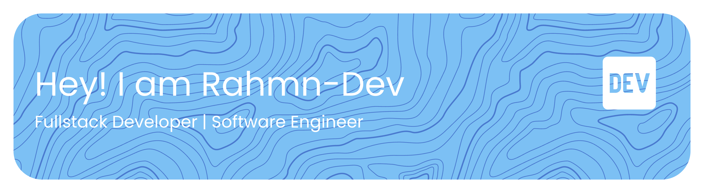

  <!-- Core Identity -->
  
  
  

  <!-- Specialty -->
  
  
  

  <!-- Strengths -->
  
  
  

  <!-- Personal Brand Aesthetic -->
  
  

<h4 align="center">Skills</h4>

<!-- ========================= -->
<!--       LANGUAGES          -->
<!-- ========================= -->
<h5 align="center">Languages</h5>

  

<!-- ========================= -->
<!--       FRONTEND           -->
<!-- ========================= -->
<h5 align="center">Frontend Development</h5>

  

<!-- ========================= -->
<!--       BACKEND            -->
<!-- ========================= -->
<h5 align="center">Backend Development</h5>

  

<!-- ========================= -->
<!--       CLOUD / DEVOPS     -->
<!-- ========================= -->
<h5 align="center">Cloud & DevOps</h5>

  

<!-- ========================= -->
<!--       DATABASES          -->
<!-- ========================= -->
<h5 align="center">Databases</h5>

  

<!-- ========================= -->
<!--       AI / MACHINE LEARNING -->
<!-- ========================= -->
<h5 align="center">AI & Machine Learning</h5>

  

<!-- ========================= -->
<!--       TOOLS & DESIGN     -->
<!-- ========================= -->
<h5 align="center">Tools & Design</h5>

  

 
<h4 align="center">Streak Stats</h4>

  

<h4 align="center">Activity Graph</h4>

  

